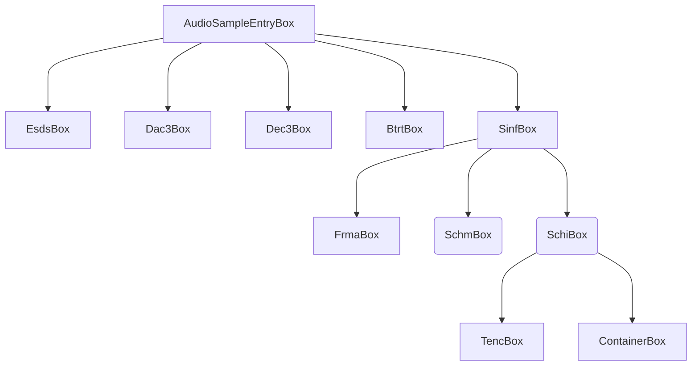
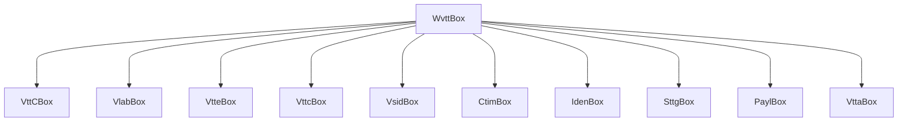
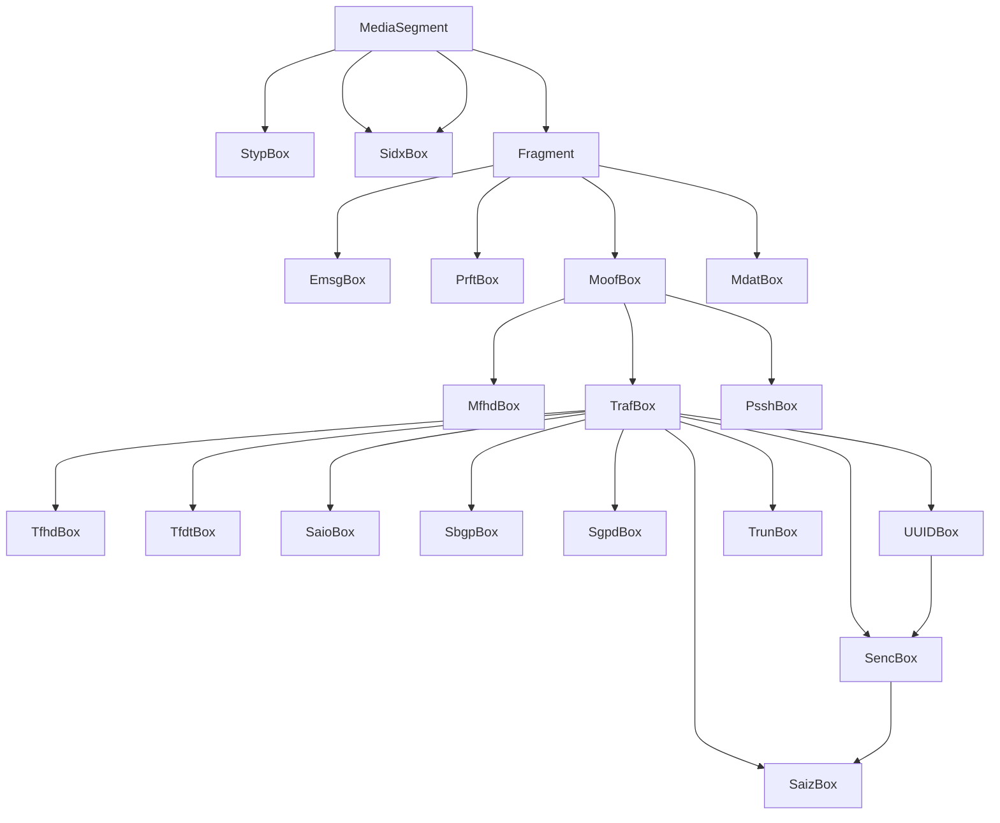

### Flow

```mermaid
graph TD
    audio_sample_entry_box[AudioSampleEntryBox]
    audio_sample_entry_box--->esds_box[EsdsBox]
    audio_sample_entry_box--->dac3_box[Dac3Box]
    audio_sample_entry_box--->dec3_box[Dec3Box]
    audio_sample_entry_box--->btrt_box[BtrtBox]
    audio_sample_entry_box--->sinf_box[SinfBox]
    sinf_box--->frma_box[FrmaBox]
    sinf_box--->schm_box(SchmBox)
    sinf_box--->schi_box(SchiBox)
    schi_box--->tenc_box[TencBox]
    schi_box--->container_box[ContainerBox]    
```
```mermaid
graph TD

```

```mermaid
graph TD
    wvtt_box[WvttBox]--->vtt_c_box[VttCBox]
    wvtt_box--->vlab_box[VlabBox]
    wvtt_box--->vtte_box[VtteBox]
    wvtt_box--->vttc_box[VttcBox]
    wvtt_box--->vsid_box[VsidBox]
    wvtt_box--->ctim_box[CtimBox]
    wvtt_box--->iden_box[IdenBox]
    wvtt_box--->sttg_box[SttgBox]
    wvtt_box--->payl_box[PaylBox]
    wvtt_box--->vtta_box[VttaBox]
```

```mermaid
graph TD
    media_segment[MediaSegment]--->styp_box[StypBox]
    media_segment--->sidx_box[SidxBox]
    media_segment--->sidx_box[SidxBox]
    media_segment--->fragment[Fragment]
    fragment--->emsg_box[EmsgBox]
    fragment--->prft_box[PrftBox]
    fragment--->moof_box[MoofBox]
    fragment--->mdat_box[MdatBox]
    moof_box--->mfhd_box[MfhdBox]
    moof_box--->traf_box[TrafBox]
    moof_box--->pssh_box[PsshBox]
    traf_box--->tfhd_box[TfhdBox]
    traf_box--->tfdt_box[TfdtBox]
    traf_box--->saiz_box[SaizBox]
    traf_box--->saio_box[SaioBox]
    traf_box--->sbgp_box[SbgpBox]
    traf_box--->sgpd_box[SgpdBox]
    traf_box--->senc_box[SencBox]
    traf_box--->uuid_box[UUIDBox]
    uuid_box--->senc_box
    senc_box--->saiz_box[SaizBox]
    traf_box--->trun_box[TrunBox]
```
