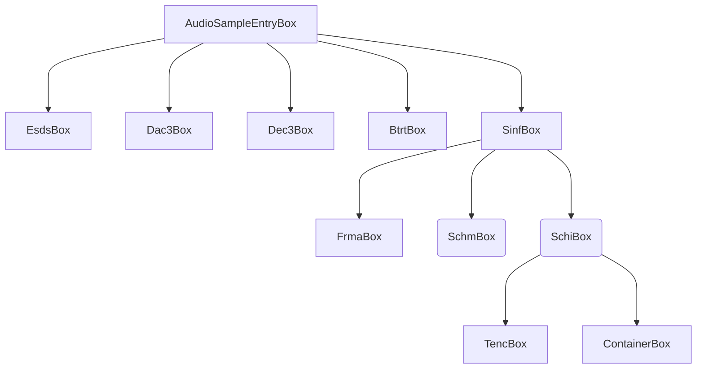
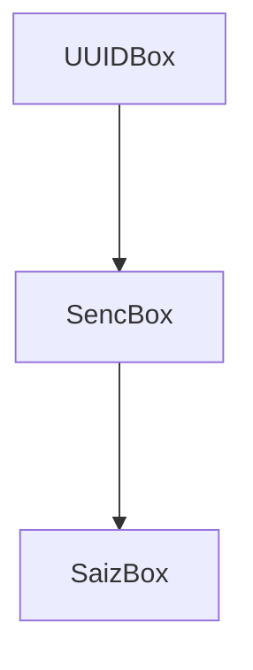

### Flow

```mermaid
graph TD
    audio_sample_entry_box[AudioSampleEntryBox]
    audio_sample_entry_box--->esds_box[EsdsBox]
    audio_sample_entry_box--->dac3_box[Dac3Box]
    audio_sample_entry_box--->dec3_box[Dec3Box]
    audio_sample_entry_box--->btrt_box[BtrtBox]
    audio_sample_entry_box--->sinf_box[SinfBox]
    sinf_box--->frma_box[FrmaBox]
    sinf_box--->schm_box(SchmBox)
    sinf_box--->schi_box(SchiBox)
    schi_box--->tenc_box[TencBox]
    schi_box--->container_box[ContainerBox]
    
```

```mermaid
graph TD
    uuid_box[UUIDBox]--->senc_box[SencBox]
    senc_box--->saiz_box[SaizBox]
```
